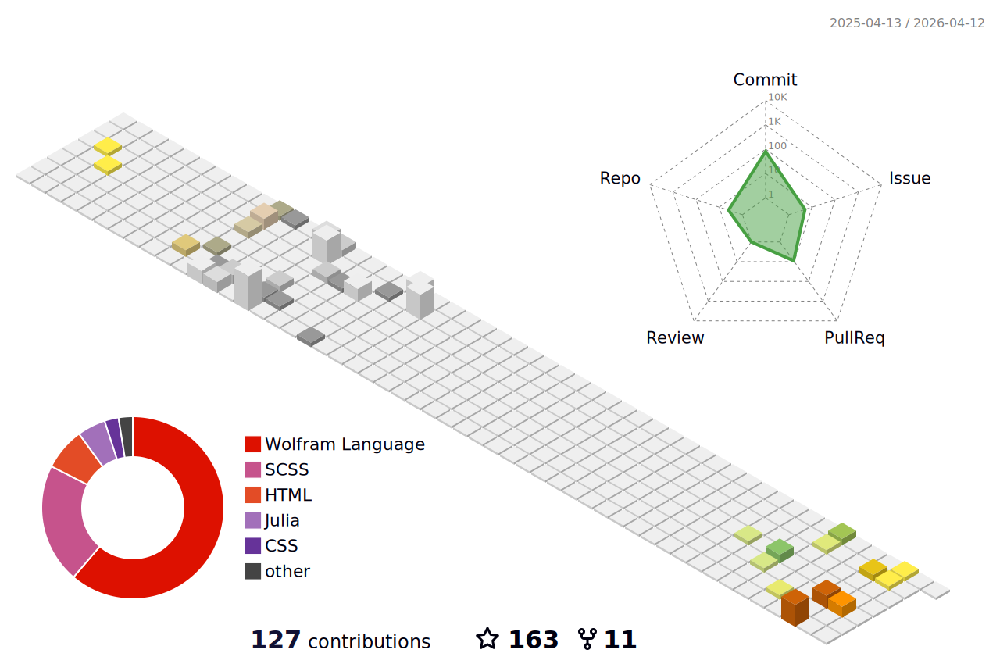

<h1 align="center">
  Welcome to Leticia Maria Pequeno Madureira's profile!
  
</h1>

  
  
  
  
   
   
  
  

 

  

 

  

 

  

  

  
  
  
  
  
  
  
  
  
  
  
  
  
  
  
  
  
  
  
  
  
  
  
  
  
  
  
  
  
  
  

